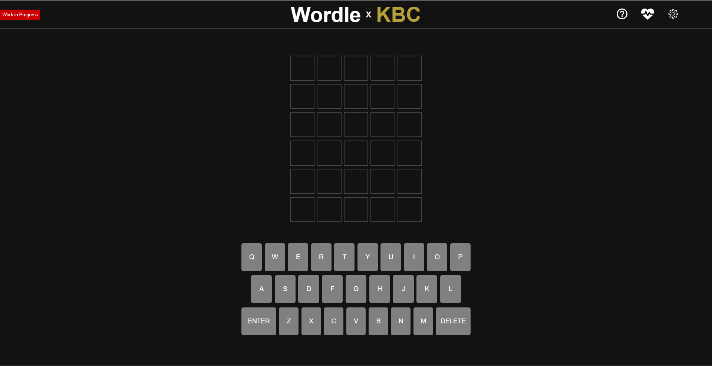
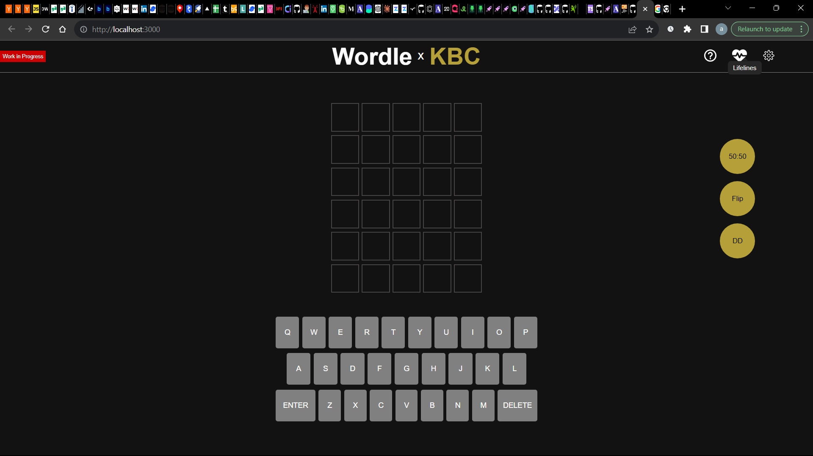

#  WordKBC – Wordle with KBC Lifelines

A word-guessing game inspired by **Wordle**, enhanced with **Kaun Banega Crorepati (KBC)**-style lifelines to assist players strategically.

---

##  Overview

**WordKBC** is a twist on the classic Wordle game where players can use **lifelines**—just like in KBC—to improve their chances of guessing the correct word.

Instead of relying purely on guessing, players must **think strategically about when to use lifelines**, making the game more engaging and tactical.

---
## 📸 Screenshots

### Home Page

### Projects Page

---

## 🎮 How to Play

### 🎯 Objective

Guess the **5-letter WORDLE** in **6 attempts**.

* Each guess must be a valid 5-letter word
* Press **Enter** to submit your guess
* After each guess, tiles change color to indicate accuracy:

  * 🟩 Correct letter in correct position
  * 🟨 Correct letter in wrong position
  * ⬛ Letter not in the word

---

## 🧩 Game Concept

This is not just a single round game — it’s a **7-day challenge**:

* You must solve a new word **each day**
* If you lose on any day → game resets to **Day 1**
* Rewards are unlocked at:

  * 🏆 Day 3
  * 🏆 Day 5
  * 🏆 Day 7

> This creates a **progression system + pressure**, similar to KBC.

---

##  Lifelines (Core Feature)

Inspired by KBC, you get **limited-use lifelines** to help you win:

### 🟡 50:50

* Reveals **half of the letters** of the word
* Can be used **only once in the entire 7-day run**

---

### 🔄 Flip

* Changes the current word
* Resets the board completely
* Can be used **only once in the entire 7-day run**

---

### 🎯 Double Dip (DD)

* Gives **one extra attempt** beyond the normal limit
* Can be used **only once in the entire 7-day run**

---

##  Key Mechanics

* One new Wordle available **every day**
* Lifelines are **scarce → must be used strategically**
* Losing at any stage resets full progress
* Encourages **risk vs reward decision-making**

---

##  What Makes This Unique

* Combines **Wordle gameplay + KBC progression system**
* Introduces **long-term strategy (7-day survival)**
* Lifelines are **limited across the entire game**, not per round
* Creates a **game-show-like tension** in a word puzzle

---

##  Demo

---

##  Tech Stack

* **Frontend:** React.js 
* **Language:** JavaScript
* **Styling:** CSS
* **State Management:** React Hooks and Context API

---

##  Project Highlights

* Combines **two different game mechanics** into one product
* Focus on **user engagement and retention**
* Clean and modular component structure
* Real-world UI/UX thinking applied

---

##  Challenges Faced

* Managing **dual game logic** (word + lifelines)
* Keeping state predictable across levels
* Designing intuitive feedback system
* Handling edge cases (partial matches, retries, resets)

---

##  Acknowledgements

Inspired by:

* Word-based puzzle games
* Quiz-based game shows